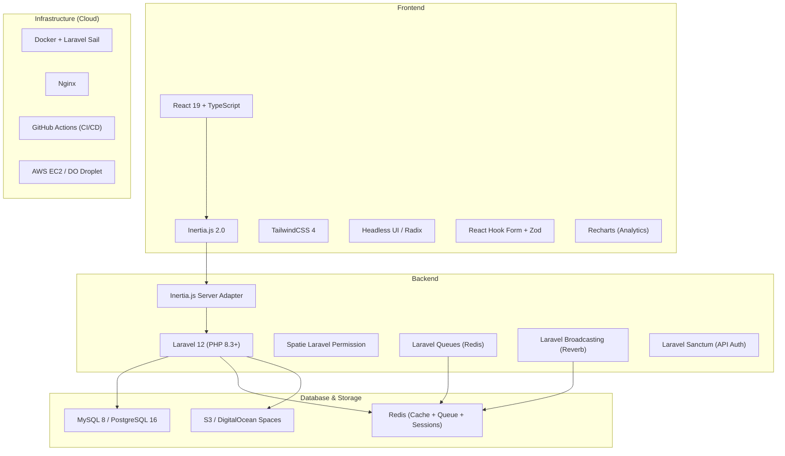
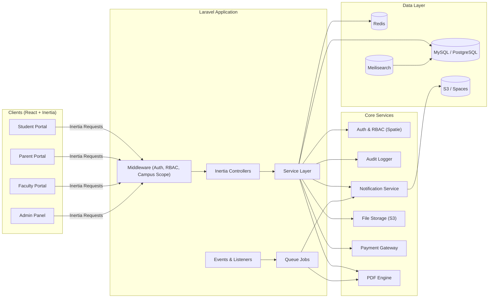
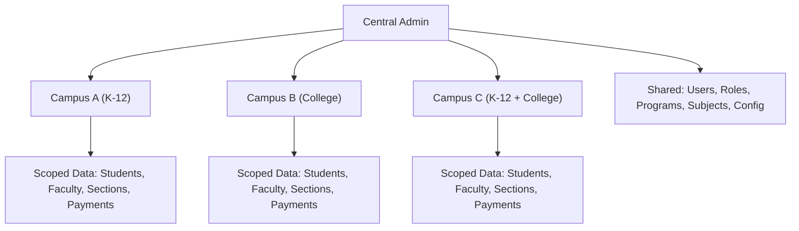
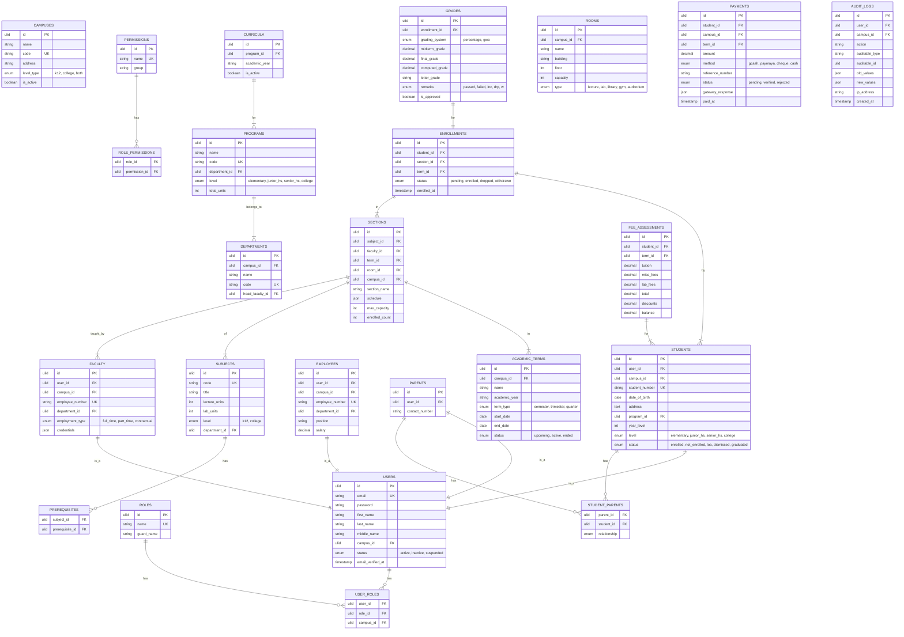
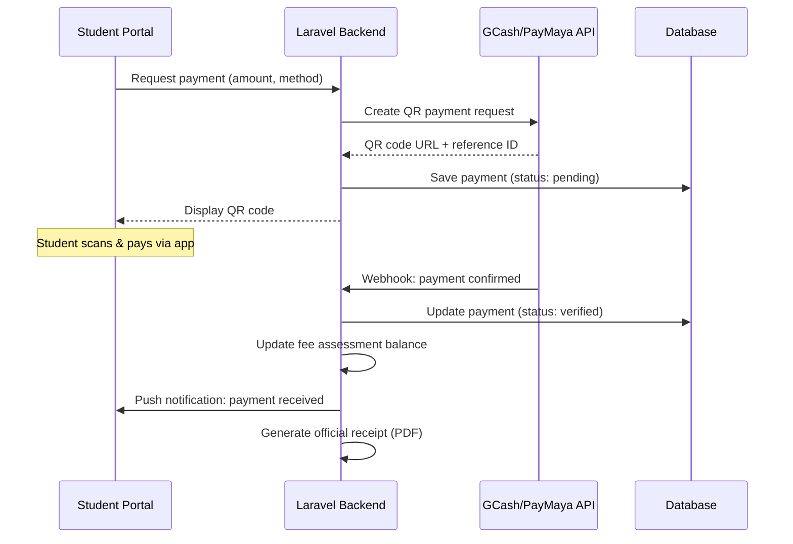
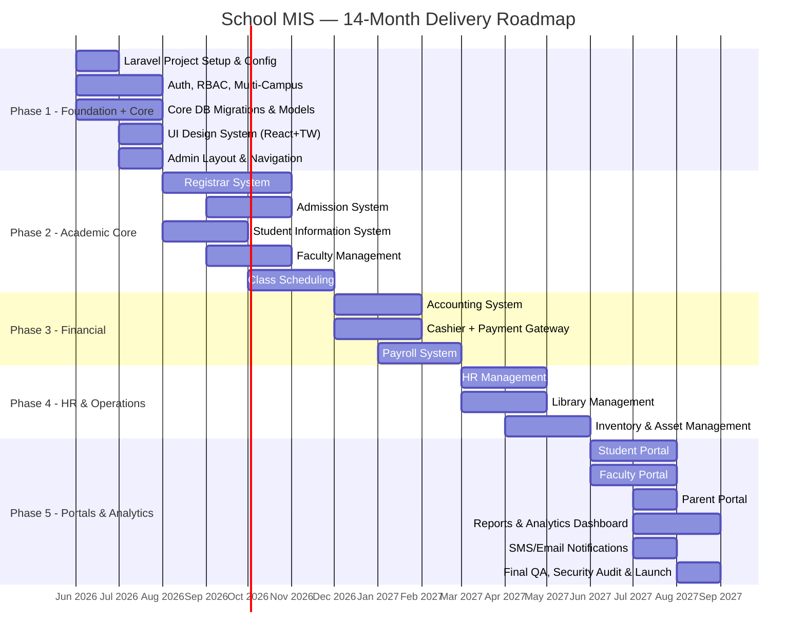

# School Management Information System (School MIS) — Implementation Plan (Revised)

## 1. Overview & Goals

Build a **centralized, multi-campus, web-based School Management Information System** supporting **both K-12 and College/University** levels. The system unifies **16 priority modules** into a single ecosystem with shared authentication, a centralized database, and role-specific portals for students, parents, faculty, staff, and administrators.

### Key Principles

| Principle | Description |
|---|---|
| **Centralized Data** | Single MySQL/PostgreSQL database — no data silos, no duplicate records |
| **Multi-Campus** | Campus-scoped data with a central admin that can oversee all campuses |
| **Dual Grading** | Percentage-based for College/University; GWA for High School |
| **Modular Monolith** | Laravel domain modules that share core services but remain decoupled |
| **Role-Based Access** | Every route, controller, and action gated by Spatie Permission RBAC |
| **Audit Everything** | All mutations logged with actor, timestamp, before/after state |
| **Cloud-Native** | Deployed on cloud (AWS / DigitalOcean) with auto-scaling capability |

### Resolved Questions

| Question | Decision |
|---|---|
| School levels | **Both** — K-12 (Elementary + Junior High + Senior High) and College/University |
| Multi-campus | **Yes** — campus-scoped data with central admin oversight |
| Grading system | **Dual** — Percentage → letter grade (College); GWA computation (High School) |
| Deployment | **Cloud** — AWS or DigitalOcean with managed database |
| Payment gateways | **GCash QR**, **PayMaya QR**, **Cheque** |
| Data migration | **None** — fresh start, no legacy systems |
| LMS | Custom built-in (Assignments, Quizzes, Materials) |
| Mobile | Responsive PWA (no native app) |

---

## 2. Technology Stack



| Layer | Technology | Rationale |
|---|---|---|
| **Backend Framework** | Laravel 12 (PHP 8.3+) | Mature ecosystem, Eloquent ORM, built-in queues, scheduling, broadcasting |
| **Frontend Framework** | React 19 + TypeScript | Type-safe components, large ecosystem, strong developer tooling |
| **Bridge** | Inertia.js 2.0 | SPA feel without building a separate API — server-driven routing with React views |
| **Styling** | TailwindCSS 4 | Utility-first, rapid UI development, consistent design tokens |
| **UI Components** | Headless UI + Radix | Accessible, unstyled primitives we can theme with Tailwind |
| **Auth & RBAC** | Spatie Laravel Permission | Battle-tested roles/permissions package for Laravel |
| **API Auth** | Laravel Sanctum | Token-based API auth for mobile/external integrations |
| **Database** | MySQL 8 (primary) / PostgreSQL 16 (alt) | Reliable, well-supported by Laravel, managed options on all clouds |
| **Cache / Queue** | Redis | Session store, query cache, queue driver, broadcasting backend |
| **File Storage** | S3 / DO Spaces | Documents, images, e-books — Laravel Filesystem abstraction |
| **Real-time** | Laravel Reverb | WebSocket server for live notifications (native Laravel) |
| **PDF Generation** | Laravel DomPDF / Browsershot | Transcripts, receipts, reports, financial statements |
| **Email** | Laravel Mail (Resend/SMTP) | Transactional emails, templated notifications |
| **SMS** | Semaphore / Vonage | SMS blasts for Philippines-based service |
| **Payment** | GCash API, PayMaya API | QR code payment generation and webhook verification |
| **Search** | Laravel Scout + Meilisearch | Full-text search for students, documents, catalog |
| **Dev Environment** | Laravel Sail (Docker) | One-command local development setup |
| **CI/CD** | GitHub Actions | Lint → Test → Build → Deploy pipeline |
| **Cloud Hosting** | AWS (EC2 + RDS + S3) or DigitalOcean (Droplet + Managed DB + Spaces) | Scalable, managed database, object storage |

---

## 3. High-Level Architecture



### Multi-Campus Architecture



Every query is **campus-scoped** via a global Eloquent scope. Central admin can switch campus context or view aggregate data across all campuses.

---

## 4. Database Architecture — Core ERD



---

## 5. Dual Grading Engine

The system supports two grading systems based on the student's level:

### College / University — Percentage-Based

```
| Percentage Range | Letter Grade | Grade Point |
|-----------------|-------------|-------------|
| 97–100          | 1.00        | Excellent   |
| 94–96           | 1.25        |             |
| 91–93           | 1.50        | Very Good   |
| 88–90           | 1.75        |             |
| 85–87           | 2.00        | Good        |
| 82–84           | 2.25        |             |
| 79–81           | 2.50        | Satisfactory|
| 76–78           | 2.75        |             |
| 75              | 3.00        | Passing     |
| Below 75        | 5.00        | Failed      |
```

### High School (K-12) — GWA-Based

```
| Grade Range | Descriptor          |
|------------|---------------------|
| 90–100     | Outstanding          |
| 85–89      | Very Satisfactory    |
| 80–84      | Satisfactory         |
| 75–79      | Fairly Satisfactory  |
| Below 75   | Did Not Meet Expectations |
```

> [!NOTE]
> The grading scale tables above are configurable via the admin panel. Schools can customize ranges and descriptors without code changes.

---

## 6. Payment Integration Design



**Cheque Processing**: Manual entry by cashier → pending verification → clearance after bank confirmation (3–5 business days) → status update.

---

## 7. Module Breakdown (Prioritized Build Order)

### Priority 1 — Academic Core (Phase 1–2)

---

#### Module 1: Registrar System
**Laravel Domain**: `app/Modules/Registrar/`

| Feature | Description |
|---|---|
| Enrollment | Term-based workflow: subject selection → prerequisite validation → section assignment → fee assessment → confirmation |
| Student Records | CRUD profiles, program changes, status updates (regular, irregular, LOA, dismissed, graduated) |
| Grades | Faculty submission → Department Head review → Registrar approval → grade release pipeline |
| Transcript Generation | PDF with school seal, QR verification code, cumulative GWA/weighted average |
| Graduation Processing | Checklist engine: units completed, residency requirement, clearance, deficiency checker |

**Key Files**:
- `app/Modules/Registrar/Controllers/EnrollmentController.php`
- `app/Modules/Registrar/Controllers/GradeController.php`
- `app/Modules/Registrar/Services/EnrollmentService.php`
- `app/Modules/Registrar/Services/TranscriptService.php`
- `app/Modules/Registrar/Services/GraduationService.php`
- `resources/js/Modules/Registrar/Pages/Enrollment/Index.tsx`
- `resources/js/Modules/Registrar/Pages/Grades/Submission.tsx`

---

#### Module 2: Admission System
**Laravel Domain**: `app/Modules/Admission/`

| Feature | Description |
|---|---|
| Online Applications | Public-facing multi-step form with document upload, application tracking number |
| Entrance Examinations | Exam scheduling, room assignment, score recording, auto-ranking |
| Applicant Evaluation | Scoring rubric, interview notes, document verification workflow |
| Acceptance Management | Accept/waitlist/reject with automated email/SMS notifications |

---

#### Module 3: Student Information System (SIS)
**Laravel Domain**: `app/Modules/StudentInfo/`

| Feature | Description |
|---|---|
| Student Profiles | Comprehensive dashboard: demographics, photo, emergency contacts, guardian info |
| Academic History | Term-by-term grade history, cumulative units, GWA/average trend chart |
| Discipline Records | Cross-reference to Discipline module; violation summary on profile |
| Attendance Tracking | Per-subject attendance (QR scan / manual entry), absence threshold alerts |

---

#### Module 4: Faculty Management
**Laravel Domain**: `app/Modules/Faculty/`

| Feature | Description |
|---|---|
| Faculty Profiles | Credentials, specializations, educational attainment, photo |
| Teaching Loads | Term-based load assignment, overload computation (max units configurable) |
| Credentials | License tracking, certifications, continuing education, expiry alerts |
| Performance Evaluations | Student evaluation forms, peer reviews, admin assessments with scoring |

---

#### Module 5: Class Scheduling
**Laravel Domain**: `app/Modules/Scheduling/`

| Feature | Description |
|---|---|
| Subject Offerings | Term-based catalog: which subjects are offered, how many sections |
| Room Assignments | Algorithm to match rooms by capacity, type (lecture/lab), campus, availability |
| Faculty Schedules | Visual weekly timetable with drag-and-drop section editing |
| Conflict Detection | Real-time detection of room double-booking, faculty overlap, student conflicts |

---

### Priority 2 — Financial (Phase 3)

---

#### Module 6: Accounting System
**Laravel Domain**: `app/Modules/Accounting/`

| Feature | Description |
|---|---|
| General Ledger | Double-entry bookkeeping, chart of accounts, journal entries |
| Financial Statements | Auto-generated income statement, balance sheet, cash flow per campus |
| Budget Management | Department-level budgets, allocation tracking, variance analysis |

---

#### Module 7: Cashier System
**Laravel Domain**: `app/Modules/Cashier/`

| Feature | Description |
|---|---|
| Fee Assessment | Auto-computed tuition + misc + lab fees based on enrolled units/program |
| Payment Processing | GCash QR, PayMaya QR, Cheque recording, cash payments |
| Official Receipts | Auto-numbered receipts with QR verification, PDF generation |
| Payment History | Student payment ledger, balance tracking, installment schedules, aging reports |

---

#### Module 8: Payroll System
**Laravel Domain**: `app/Modules/Payroll/`

| Feature | Description |
|---|---|
| Faculty Salaries | Salary grade computation, overload pay, hourly rate calculation |
| Staff Salaries | Monthly payroll processing, 13th month pay, bonuses |
| Benefits | SSS, PhilHealth, Pag-IBIG, HMO tracking and computation |
| Deductions | BIR tax tables, loan deductions, absence deductions, net pay computation |

---

### Priority 3 — HR & Library (Phase 4)

---

#### Module 9: HR Management
**Laravel Domain**: `app/Modules/HR/`

| Feature | Description |
|---|---|
| Employee Records | Personal info, employment history, 201 file digitization |
| Recruitment | Job postings, applicant tracking, interview scheduling, hiring workflow |
| Leave Management | Leave types (VL, SL, ML, PL), balance tracking, multi-level approval |
| Timekeeping | Biometric device integration (ZKTeco API), DTR generation, overtime |
| Performance Evaluation | KPI-based evaluation, 360-degree feedback forms |

---

#### Module 10: Library Management
**Laravel Domain**: `app/Modules/Library/`

| Feature | Description |
|---|---|
| Cataloging | Book/material catalog with categories, ISBN lookup, barcode generation |
| Borrowing | Check-out/check-in with barcode scanning, due date tracking, renewals |
| Fines | Overdue fine auto-computation, payment integration with Cashier module |
| E-books | Digital library with online viewer, download tracking, access control |

---

#### Module 11: Inventory & Asset Management
**Laravel Domain**: `app/Modules/Inventory/`

| Feature | Description |
|---|---|
| Asset Registry | Equipment/furniture tracking with barcode/QR tagging, location, custodian |
| Supplies | Consumable inventory, stock levels, reorder-point alerts |
| Procurement | Purchase request → approval → PO → supplier → delivery → receiving |
| Depreciation | Straight-line depreciation computation, asset value tracking |
| Asset Transfers | Transfer requests between campuses/departments, custodian handover |

---

### Priority 4 — Portals (Phase 5)

---

#### Module 12: Student Portal
**Laravel Domain**: `app/Modules/Portal/Student/`

| Feature | Description |
|---|---|
| Dashboard | At-a-glance: current enrollment, GWA, balance, announcements |
| Grades | View released grades by term, GWA trend chart |
| Enrollment | Self-service enrollment: subject selection, section picking, prerequisite check |
| Payments | View assessment, pay via GCash/PayMaya QR, download receipts |
| Announcements | Campus-specific and system-wide announcements feed |
| Schedule | Visual weekly class schedule |

---

#### Module 13: Faculty Portal
**Laravel Domain**: `app/Modules/Portal/Faculty/`

| Feature | Description |
|---|---|
| Dashboard | Teaching load summary, upcoming classes, pending tasks |
| Class Lists | Roster per section with student photos, contact info |
| Grade Submission | Enter midterm/final grades, compute final, submit for approval |
| Attendance | Mark attendance per session, view attendance summary |
| Teaching Schedule | Visual weekly timetable |
| Course Materials | Upload/manage files and links per subject-section |

---

#### Module 14: Parent Portal
**Laravel Domain**: `app/Modules/Portal/Parent/`

| Feature | Description |
|---|---|
| Dashboard | Overview of all linked children's status |
| Student Progress | View child's grades, GWA trend, class standing |
| Attendance | View child's attendance record, receive absence alerts |
| Billing | View fee assessment, payment history, outstanding balance |
| Announcements | Campus and class-level announcements |

---

### Priority 5 — Analytics & Notifications (Phase 6)

---

#### Module 15: Reports & Analytics Dashboard
**Laravel Domain**: `app/Modules/Analytics/`

| Feature | Description |
|---|---|
| Enrollment Statistics | Headcount trends, program distribution, retention/dropout rates, per-campus |
| Financial Reports | Revenue, collections efficiency, aging receivables, budget vs. actual |
| Student Performance | GWA distribution, pass/fail rates, dean's list, at-risk students |
| Faculty Analytics | Teaching load distribution, evaluation scores, attendance |
| Custom Reports | Report builder with filters, export to PDF/Excel |

---

#### Module 16: SMS/Email Notification System
**Laravel Domain**: `app/Modules/Notification/`

| Feature | Description |
|---|---|
| Email Notifications | Transactional emails via Resend/SMTP — enrollment confirmation, grade release, payment receipt |
| SMS Notifications | Via Semaphore — enrollment updates, payment reminders, emergency announcements |
| In-App Notifications | Real-time via Laravel Reverb WebSocket, notification center with read/unread |
| Notification Preferences | Users can toggle which notifications they receive per channel |
| Broadcast Messaging | Admin can send bulk SMS/email to filtered groups (by campus, program, year level) |

---

## 8. Shared Core Services

These Laravel services are used across all modules:

| Service | Location | Purpose |
|---|---|---|
| **Auth & RBAC** | `app/Core/Auth/` | Spatie Permission, campus-scoped guards, login/register |
| **Multi-Campus** | `app/Core/Campus/` | Global scope, campus context middleware, campus switcher |
| **Audit Logger** | `app/Core/Audit/` | Model observer that auto-logs all create/update/delete |
| **Notification Dispatcher** | `app/Core/Notification/` | Unified dispatcher (email, SMS, in-app, push) |
| **File Storage** | `app/Core/Storage/` | S3 upload/download, image resizing, virus scanning |
| **PDF Engine** | `app/Core/Pdf/` | DomPDF/Browsershot for transcripts, receipts, reports |
| **Workflow Engine** | `app/Core/Workflow/` | Configurable multi-step approval chains (grades, leave, procurement) |
| **Grading Engine** | `app/Core/Grading/` | Dual grading computation (percentage ↔ GWA), configurable scales |
| **Search** | `app/Core/Search/` | Laravel Scout + Meilisearch for full-text search |
| **Settings** | `app/Core/Settings/` | System-wide and per-campus configuration (academic year, term, grading scale) |

---

## 9. Project Structure

```
school-mis/
├── app/
│   ├── Core/                          # Shared core services
│   │   ├── Auth/
│   │   │   ├── Controllers/
│   │   │   ├── Middleware/
│   │   │   │   ├── CampusScopeMiddleware.php
│   │   │   │   └── RoleMiddleware.php
│   │   │   └── Providers/
│   │   ├── Audit/
│   │   │   ├── Models/AuditLog.php
│   │   │   └── Observers/AuditObserver.php
│   │   ├── Campus/
│   │   │   ├── Models/Campus.php
│   │   │   ├── Scopes/CampusScope.php
│   │   │   └── Traits/HasCampus.php
│   │   ├── Grading/
│   │   │   ├── PercentageGrading.php
│   │   │   ├── GWAGrading.php
│   │   │   └── GradingFactory.php
│   │   ├── Notification/
│   │   ├── Pdf/
│   │   ├── Search/
│   │   ├── Settings/
│   │   ├── Storage/
│   │   └── Workflow/
│   ├── Modules/                       # Domain modules
│   │   ├── Registrar/
│   │   │   ├── Controllers/
│   │   │   ├── Models/
│   │   │   ├── Services/
│   │   │   ├── Requests/
│   │   │   ├── Events/
│   │   │   ├── Listeners/
│   │   │   ├── Jobs/
│   │   │   ├── Policies/
│   │   │   └── routes.php
│   │   ├── Admission/
│   │   │   └── ... (same structure)
│   │   ├── StudentInfo/
│   │   ├── Faculty/
│   │   ├── Scheduling/
│   │   ├── Accounting/
│   │   ├── Cashier/
│   │   ├── Payroll/
│   │   ├── HR/
│   │   ├── Library/
│   │   ├── Inventory/
│   │   ├── Portal/
│   │   │   ├── Student/
│   │   │   ├── Faculty/
│   │   │   └── Parent/
│   │   ├── Analytics/
│   │   └── Notification/
│   ├── Models/                        # Shared Eloquent models
│   │   ├── User.php
│   │   ├── Student.php
│   │   ├── Faculty.php
│   │   ├── Employee.php
│   │   ├── Parent.php
│   │   ├── Department.php
│   │   ├── Program.php
│   │   ├── Subject.php
│   │   ├── AcademicTerm.php
│   │   ├── Section.php
│   │   ├── Enrollment.php
│   │   ├── Grade.php
│   │   ├── Room.php
│   │   └── Payment.php
│   └── Providers/
│       └── ModuleServiceProvider.php  # Auto-registers all modules
├── resources/
│   ├── js/
│   │   ├── app.tsx                    # Inertia app bootstrap
│   │   ├── types/                     # Shared TypeScript types
│   │   │   ├── index.d.ts
│   │   │   ├── models.ts             # Auto-generated from Laravel models
│   │   │   └── enums.ts
│   │   ├── Components/                # Shared UI components
│   │   │   ├── ui/                    # Base components (Button, Input, Modal, Table, etc.)
│   │   │   ├── layouts/              # AdminLayout, PortalLayout, AuthLayout
│   │   │   ├── navigation/
│   │   │   └── data-display/         # Charts, stats cards, badges
│   │   ├── Modules/                   # Module-specific React pages
│   │   │   ├── Registrar/
│   │   │   │   ├── Pages/
│   │   │   │   │   ├── Enrollment/
│   │   │   │   │   │   ├── Index.tsx
│   │   │   │   │   │   ├── Create.tsx
│   │   │   │   │   │   └── Show.tsx
│   │   │   │   │   ├── Grades/
│   │   │   │   │   ├── Students/
│   │   │   │   │   └── Transcripts/
│   │   │   │   └── Components/       # Module-specific components
│   │   │   ├── Admission/
│   │   │   ├── StudentInfo/
│   │   │   ├── Faculty/
│   │   │   ├── Scheduling/
│   │   │   ├── Accounting/
│   │   │   ├── Cashier/
│   │   │   ├── Payroll/
│   │   │   ├── HR/
│   │   │   ├── Library/
│   │   │   ├── Inventory/
│   │   │   ├── Portal/
│   │   │   │   ├── Student/
│   │   │   │   ├── Faculty/
│   │   │   │   └── Parent/
│   │   │   ├── Analytics/
│   │   │   └── Notification/
│   │   ├── hooks/                     # Shared React hooks
│   │   └── lib/                       # Utilities, helpers
│   ├── css/
│   │   └── app.css                    # Tailwind directives + custom styles
│   └── views/
│       └── app.blade.php             # Inertia root template
├── database/
│   ├── migrations/                    # Timestamped migrations
│   ├── seeders/
│   │   ├── DatabaseSeeder.php
│   │   ├── RolesAndPermissionsSeeder.php
│   │   ├── CampusSeeder.php
│   │   └── DemoDataSeeder.php
│   └── factories/                     # Model factories for testing
├── routes/
│   ├── web.php                        # Loads module routes
│   ├── api.php                        # API routes (Sanctum-protected)
│   └── channels.php                   # Broadcasting channels
├── tests/
│   ├── Unit/
│   │   ├── Core/
│   │   └── Modules/
│   ├── Feature/
│   │   ├── Registrar/
│   │   ├── Enrollment/
│   │   └── ...
│   └── Browser/                       # Laravel Dusk (E2E)
├── docker-compose.yml                 # MySQL, Redis, Meilisearch, MinIO
├── .env.example
├── composer.json
├── package.json
├── tsconfig.json
├── tailwind.config.ts
└── vite.config.ts
```

---

## 10. RBAC — Roles & Permissions

| Role | Portal Access | Key Permissions |
|---|---|---|
| **Super Admin** | Admin Panel | Full system access, campus management, system config |
| **Campus Admin** | Admin Panel (campus-scoped) | All modules within assigned campus |
| **Registrar** | Admin Panel | Enrollment, grades approval, student records, transcripts |
| **Admissions Officer** | Admin Panel | Applications, exams, acceptance |
| **Cashier** | Admin Panel | Payments, receipts, fee assessments |
| **Accountant** | Admin Panel | Ledger, financial statements, budgets |
| **HR Officer** | Admin Panel | Employee records, recruitment, leave, payroll |
| **Dean / Dept Head** | Admin + Faculty Portal | Department oversight, faculty loads, grade approval |
| **Faculty** | Faculty Portal | Grade submission, attendance, class materials |
| **Librarian** | Admin Panel | Catalog, borrowing, fines |
| **Inventory Officer** | Admin Panel | Assets, supplies, procurement |
| **Student** | Student Portal | View grades, enroll, pay, view materials |
| **Parent / Guardian** | Parent Portal | View child's grades, attendance, billing |

---

## 11. Phased Delivery Roadmap



### Phase Summary

| Phase | Duration | Modules | Milestone |
|---|---|---|---|
| **1 — Foundation** | Months 1–2 | Laravel scaffold, Auth, RBAC, multi-campus, DB schema, UI kit | Dev environment + core ready |
| **2 — Academic Core** | Months 3–6 | Registrar, Admissions, SIS, Faculty, Scheduling | Enrollment & grading operational |
| **3 — Financial** | Months 7–9 | Accounting, Cashier (GCash/PayMaya/Cheque), Payroll | Payment collection & payroll live |
| **4 — HR & Operations** | Months 10–12 | HR, Library, Inventory & Assets | Internal operations digitized |
| **5 — Portals & Analytics** | Months 13–14 | Student/Faculty/Parent Portals, Analytics, Notifications, QA | Full system launch |

---

## 12. Cloud Deployment Architecture

```mermaid
graph TB
    subgraph "Cloud Provider (AWS / DigitalOcean)"
        subgraph "Compute"
            APP1["App Server 1 (Laravel)"]
            APP2["App Server 2 (Laravel)"]
            QUEUE["Queue Worker"]
            CRON["Task Scheduler"]
            WS["Reverb WebSocket Server"]
        end

        subgraph "Load Balancer"
            LB["Nginx / ALB"]
        end

        subgraph "Data"
            DB["Managed MySQL / PostgreSQL"]
            REDIS["Managed Redis"]
            SEARCH["Meilisearch"]
            S3["S3 / Spaces (Files)"]
        end

        subgraph "CDN"
            CDN["CloudFront / CDN"]
        end
    end

    USERS["Users (Browser)"] --> CDN
    CDN --> LB
    LB --> APP1
    LB --> APP2
    APP1 & APP2 --> DB
    APP1 & APP2 --> REDIS
    APP1 & APP2 --> S3
    APP1 & APP2 --> SEARCH
    QUEUE --> DB
    QUEUE --> REDIS
    CRON --> DB
    USERS -.->|"WebSocket"| WS
    WS --> REDIS
```

| Component | AWS Option | DigitalOcean Option |
|---|---|---|
| App Servers | EC2 (t3.medium) | Droplet (4GB) |
| Database | RDS MySQL | Managed MySQL |
| Redis | ElastiCache | Managed Redis |
| File Storage | S3 | Spaces |
| CDN | CloudFront | Cloudflare (external) |
| Load Balancer | ALB | DO Load Balancer |
| Domain/SSL | Route 53 + ACM | Cloudflare |

---

## 13. Verification Plan

### Automated Tests
- **Unit Tests** (PHPUnit): Service classes, grading engine, fee computation — target **80% coverage** for core services
- **Feature Tests** (PHPUnit): Full HTTP request lifecycle — enrollment flow, grade submission, payment processing
- **Browser Tests** (Laravel Dusk): Critical user flows — login, enrollment, grade submission, payment, portal navigation
- **Frontend Tests** (Vitest): React component tests for complex UI (scheduling grid, grade entry form)
- **Run commands**: `php artisan test`, `php artisan dusk`, `npm run test`

### Manual Verification
- **UAT per Phase**: Registrar staff, cashiers, faculty, and students test with real scenarios before each phase launch
- **Load Testing** (k6): Simulate concurrent enrollment (500+ users), payment processing peaks
- **Security Audit**: OWASP top-10 checklist, SQL injection (Eloquent handles), XSS (React handles), CSRF (Laravel handles)
- **Accessibility**: WCAG 2.1 AA compliance on all portal pages

### Continuous Integration
- **CI Pipeline** (GitHub Actions): `composer lint` → `php artisan test` → `npm run build` → `php artisan dusk` on every PR
- **Staging Environment**: Cloud mirror of production for pre-release testing
- **Error Monitoring**: Sentry (Laravel + React) for runtime error tracking
- **Database Backups**: Daily automated backups with 30-day retention

---

## 14. Non-Functional Requirements

| Requirement | Target |
|---|---|
| **Response Time** | < 200ms for API, < 500ms for Inertia page loads |
| **Uptime** | 99.5% |
| **Concurrent Users** | 1,000+ simultaneous |
| **Data Retention** | 10+ years for student records |
| **Backup** | Daily automated, 30-day retention, point-in-time recovery |
| **Security** | TLS 1.3, bcrypt passwords, CSRF (Laravel), XSS (React), rate limiting |
| **Compliance** | Data Privacy Act (RA 10173), CHED/DepEd reporting requirements |
| **Browser Support** | Chrome, Firefox, Safari, Edge (last 2 versions) |
